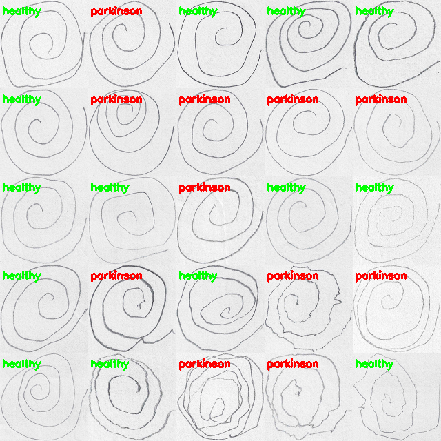

# Parkinsons-Disease-Detection

## Overview

Worked on a Medical Computer Vision project involving Parkinson's Disease Detection by using Histogram of Oriented Gradients (HOG), Machine Learning and OpenCV on the images generated by the Spiral-Wave test.
Detected non-uniform patterns and distortions in handwriting through the Spiral-Wave tests and classified images as Parkinson's or Healthy.
Used **Random Forest Classifier** for Spiral images in the dataset and **KNN** for Wave images along with **Histogram of Oriented Gradients (HOG)** for quantifying the images before training. Achieved **86.66%** accuracy for **Spiral** and **76.66%** accuracy for **Wave** images in the dataset  

## Preprocessing
The following preprocessing was applied to each image:

- Have trained the network on frontal handwritten images
- Random crops of 64 × 64 pixels from the input image of random sizes
- Randomly mirror images in each forward-backward training pass
- Data Augmentation is used

## Model Description
For **Age Classification**, following are the details of the model: 

1. 3x3 filter shape, 32 feature maps. Stride of 1 and 0 padding. Followed by: ReLU,Batch-Normalization,Max-Pool,Dropout of 0.25
2. 3x3 filter shape, 64 feature maps. Followed by: Batch-Normalization
3. 3x3 filter shape, 64 feature maps,stride 1 and padding 1. ReLU, Batch-Normalization,Max-Pool of size 2,Dropout of 0.25.
4. 3x3 filter shape, 128 feature maps. Followed by: Batch-Normalization
5. 3x3 filter shape, 128 feature maps. Followed by: Batch-Normalization
6. 3x3 filter shape, 128 feature maps,stride 1 and padding 1. ReLU, Batch-Normalization,Max-Pool of size 2,Dropout of 0.25.
7. Fully connected layer of 512 neurons. Followed by : ReLU,Batch Normalization, Dropout = 0.5. 
8. Last layer maps to the 3 classes for age

Trained with a learning rate of 0.01,Batch Size of 32 and with 75 to 100 epochs.
Used Stochastic Gradient Descent (SGD) optimizer and 70% split of train and validation data.
Used OpenCV library for image processing along with data visualization and augmentation.

## Libraries Used
1.OpenCV 
2.sklearn 
3.skimage 
4.Numpy 
5.Seaborn 
6.Matplotlib 

## Results

Spiral Test Accuracy : **86.66%**

---

Wave Test Accuracy : **76.66**

