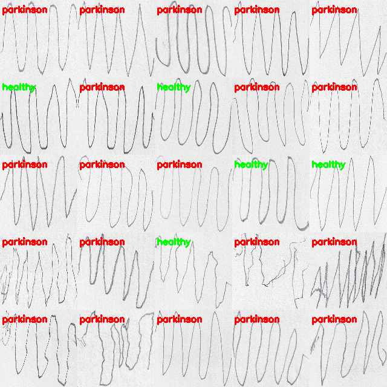

# Parkinsons-Disease-Detection

## Overview

Worked on a Medical Computer Vision project involving Parkinson's Disease Detection by using Histogram of Oriented Gradients (HOG), Machine Learning and OpenCV on the images generated by the Spiral-Wave test.
Detected non-uniform patterns and distortions in handwriting through the Spiral-Wave tests and classified images as Parkinson's or Healthy.
Used **Random Forest Classifier** for Spiral images in the dataset and **KNN** for Wave images along with **Histogram of Oriented Gradients (HOG)** for quantifying the images before training. Achieved **86.66%** accuracy for **Spiral** and **76.66%** accuracy for **Wave** images in the dataset  

## Preprocessing & Training
The following preprocessing was applied to each image:

- Have trained the network on frontal handwritten images
- Resized every image to 200 × 200 pixels from the input images of random sizes
- Converted each image from RGB to GrayScale to have a single channel using `cv2.cvtColor`
- Thresholding the image so that it appears as white on a black background for better feature extraction using `cv2.threshold`
- After this , HOG was used to extract features from the images by using `feature.hog` function
- For *Spiral* : `RandomForestClassifier` was used for fitting & For *Wave* : `KNeighborsClassifier` was used.

## Libraries Used
1.OpenCV 
2.sklearn 
3.skimage 
4.Numpy 
5.Seaborn 
6.Matplotlib 
7.Imutils 

## Results

Spiral Test Accuracy : **86.66%**

---

Wave Test Accuracy : **76.66**

## Contributors
-Rohan Limaye: https://github.com/rylp  
-Rohan Naik: https://github.com/rohan-naik07 
